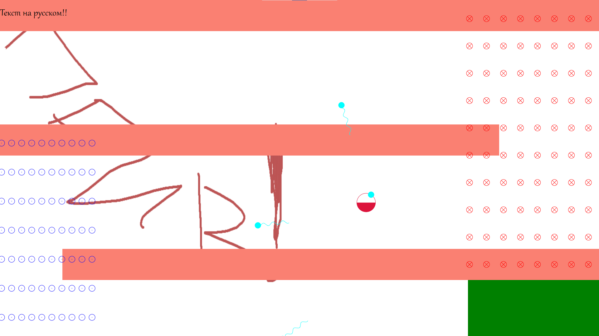

# Energy is over

C++ physics game engine featuring:
- dynamic plugin system (via dlls)
- level scripting
- physics and collision system
- hardware acceleration

## Demo



## Requirements

1. Windows SDK
2. Direct2D

## Build

```bash
msbuild
```

## Run

```bash
cd x64\Debug
game.exe
```
